# 📡 Endpoints Requeridos para Guardar Datos del Estudiante

## 🎯 Contexto
Este documento detalla **todos los endpoints** que el backend debe implementar para que el botón **"Guardar"** en `EstudianteDetail` funcione completamente.

Cuando el usuario activa **"Modo Edición"** y hace clic en **"Guardar"**, se deben actualizar 4 secciones editables:
1. **Datos Personales**
2. **Información Familiar**
3. **Informe Académico General**
4. **Desempeño por Semestre**

---

## 📋 Endpoints Implementados vs Pendientes

| Endpoint | Método | Estado | Prioridad |
|----------|--------|--------|-----------|
| `/estudiante/:id` | PATCH | ✅ Existe (verificar) | 🔴 ALTA |
| `/estudiante/:id/familia` | PATCH | ❌ Crear | 🟡 MEDIA |
| `/historial-academico/:id` | PATCH | ✅ Existe | 🔴 ALTA |
| `/asignatura` | POST | ❓ Verificar | 🟡 MEDIA |
| `/asignatura/:id` | PATCH | ❓ Verificar | 🟡 MEDIA |
| `/asignatura/estudiante/:id` | GET | ❓ Verificar | 🟡 MEDIA |

---

## 1️⃣ DATOS PERSONALES

### Endpoint
```
PATCH /estudiante/:id
```

### Descripción
Actualiza la información personal básica del estudiante.

### Request Body (Ejemplo)
```json
{
  "nombre": "Juan Pérez González",
  "rut": "12.345.678-9",
  "telefono": "+56912345678",
  "fecha_de_nacimiento": "2000-01-15",
  "email": "juan.perez@email.com",
  "tipo_de_estudiante": "universitario",
  "direccion": "Av. Principal 123",
  "region": "Metropolitana",
  "comuna": "Santiago",
  "universidad": "Universidad de Chile",
  "carrera": "Ingeniería Civil",
  "año_ingreso": 2020,
  "estado_academico": "activo",
  "tipo_beca": "Beca Completa",
  "monto_beca": 1000000,
  "duracion_beca": "4 años"
}
```

### Response Esperada
```json
{
  "id_estudiante": "1",
  "nombre": "Juan Pérez González",
  "rut": "12.345.678-9",
  // ... todos los campos actualizados
  "updated_at": "2025-12-09T22:30:00Z"
}
```

### Validaciones Necesarias
- ✅ RUT válido y único
- ✅ Email válido y único
- ✅ Teléfono en formato chileno
- ✅ Fecha de nacimiento válida (no futuro)
- ✅ ID de estudiante existe

### Implementación en Backend
```typescript
// estudiante.controller.ts
@Patch(':id')
async update(
  @Param('id') id: string,
  @Body() updateEstudianteDto: UpdateEstudianteDto
) {
  return await this.estudianteService.update(id, updateEstudianteDto);
}

// estudiante.service.ts
async update(id: string, updateDto: UpdateEstudianteDto) {
  const estudiante = await this.estudianteRepository.findOne({
    where: { id_estudiante: id }
  });
  
  if (!estudiante) {
    throw new NotFoundException(`Estudiante ${id} no encontrado`);
  }
  
  Object.assign(estudiante, updateDto);
  return await this.estudianteRepository.save(estudiante);
}
```

---

## 2️⃣ INFORMACIÓN FAMILIAR

### Endpoint
```
PATCH /estudiante/:id/familia
```

### Descripción
Actualiza la información de la familia del estudiante (mamá, papá, hermanos, otros).

### Request Body (Ejemplo)
```json
{
  "mama": {
    "tipo": "Mamá",
    "nombre": "María López",
    "edad": "65 años",
    "observaciones": "2021.05.11: Conversan para organizarse.\nHa mejorado su relación con su mamá."
  },
  "papa": {
    "tipo": "Papá",
    "nombre": "Pedro González",
    "edad": "61 años",
    "observaciones": "2021.05.11: Vive fuera de la región."
  },
  "hermanos": {
    "tipo": "Hermanas/os",
    "nombres": "Carlos (25); Pedro (18); María (11)",
    "observaciones": "2021.05.11: Comparte habitación con hermanos menores."
  },
  "otros_familiares": {
    "tipo": "Otros familiares significativos",
    "nombres": "Abuela materna (Juana); Tío materno (Claudio)",
    "observaciones": "2024.11.23: Su tío llegó a vivir a su casa."
  },
  "observaciones_generales": "Familia unida y colaborativa."
}
```

### Response Esperada
```json
{
  "id_estudiante": "1",
  "informacion_familiar": {
    "mama": { ... },
    "papa": { ... },
    // ...
  },
  "updated_at": "2025-12-09T22:30:00Z"
}
```

### Opciones de Implementación

#### Opción A: Campo JSONB en tabla `estudiante`
```typescript
// estudiante.entity.ts
@Column({ type: 'jsonb', nullable: true })
informacion_familiar: {
  mama?: { tipo: string; nombre: string; edad: string; observaciones: string };
  papa?: { tipo: string; nombre: string; edad: string; observaciones: string };
  hermanos?: { tipo: string; nombres: string; observaciones: string };
  otros_familiares?: { tipo: string; nombres: string; observaciones: string };
  observaciones_generales?: string;
};
```

#### Opción B: Tabla separada `familia`
```typescript
// familia.entity.ts
@Entity('familia')
export class Familia {
  @PrimaryGeneratedColumn()
  id_familia: number;

  @Column()
  tipo_familiar: string; // 'mama', 'papa', 'hermano', 'otro'

  @Column()
  nombre: string;

  @Column({ nullable: true })
  edad: string;

  @Column({ type: 'text', nullable: true })
  observaciones: string;

  @ManyToOne(() => Estudiante, estudiante => estudiante.familia)
  estudiante: Estudiante;
}
```

**Recomendación:** Opción A (JSONB) es más simple para este caso de uso.

### Implementación Sugerida
```typescript
// estudiante.controller.ts
@Patch(':id/familia')
async updateFamilia(
  @Param('id') id: string,
  @Body() familiaData: UpdateFamiliaDto
) {
  return await this.estudianteService.updateInformacionFamiliar(id, familiaData);
}

// estudiante.service.ts
async updateInformacionFamiliar(id: string, familiaData: any) {
  const estudiante = await this.estudianteRepository.findOne({
    where: { id_estudiante: id }
  });
  
  if (!estudiante) {
    throw new NotFoundException(`Estudiante ${id} no encontrado`);
  }
  
  estudiante.informacion_familiar = familiaData;
  return await this.estudianteRepository.save(estudiante);
}
```

---

## 3️⃣ INFORME ACADÉMICO GENERAL

### Endpoint
```
PATCH /historial-academico/:id
```

### Descripción
Actualiza el resumen académico del estudiante (totales, porcentajes, semestres).

### Request Body (Ejemplo)
```json
{
  "numero_carreras": 1,
  "semestres_finalizados": 7,
  "semestres_suspendidos": 0,
  "semestres_carrera": 10,
  "total_ramos_aprobados": 43,
  "total_ramos_reprobados": 0,
  "total_eliminados": 0,
  "porcentaje_aprobados": 100.0,
  "porcentaje_reprobados": 0.0,
  "porcentaje_cursados": 100.0,
  "semestres": [
    {
      "año": 2021,
      "semestre": 1,
      "numero_semestre_carrera": 1,
      "ramos_aprobados": 6,
      "ramos_reprobados": 0,
      "ramos_eliminados": 0,
      "total_ramos": 6,
      "observaciones": ""
    },
    {
      "año": 2021,
      "semestre": 2,
      "numero_semestre_carrera": 2,
      "ramos_aprobados": 6,
      "ramos_reprobados": 0,
      "ramos_eliminados": 0,
      "total_ramos": 6,
      "observaciones": ""
    }
    // ... más semestres
  ]
}
```

### Response Esperada
```json
{
  "id_historial_academico": 123,
  "id_estudiante": "1",
  "numero_carreras": 1,
  "semestres_finalizados": 7,
  // ... todos los campos actualizados
  "updated_at": "2025-12-09T22:30:00Z"
}
```

### Consideraciones
- El endpoint **ya existe** en `historial_academico.controller.ts`
- Verificar que soporte todos los campos del formulario
- La tabla de semestres puede ir en:
  - Campo JSONB `semestres` en `historial_academico`
  - Tabla separada `semestre_detalle` relacionada

### Implementación Actual (Verificar)
```typescript
// historial_academico.controller.ts (ya existe)
@Patch(':id')
async update(
  @Param('id') id: string, 
  @Body() updateHistorialAcademicoDto: UpdateHistorialAcademicoDto
) {
  return await this.historialAcademicoService.update(+id, updateHistorialAcademicoDto);
}
```

**TODO:** Verificar que `UpdateHistorialAcademicoDto` incluya todos los campos necesarios.

---

## 4️⃣ DESEMPEÑO POR SEMESTRE (ASIGNATURAS)

### Endpoints Necesarios

#### A. Crear Asignatura
```
POST /asignatura
```

**Request Body:**
```json
{
  "id_estudiante": "1",
  "nombre": "Cálculo I",
  "nota": 5.8,
  "estado": "aprobado",
  "año": 2025,
  "semestre": 1,
  "observaciones": "Buen desempeño en pruebas"
}
```

**Response:**
```json
{
  "id_asignatura": 456,
  "id_estudiante": "1",
  "nombre": "Cálculo I",
  "nota": 5.8,
  "estado": "aprobado",
  "año": 2025,
  "semestre": 1,
  "observaciones": "Buen desempeño en pruebas",
  "created_at": "2025-12-09T22:30:00Z"
}
```

#### B. Actualizar Asignatura
```
PATCH /asignatura/:id
```

**Request Body:**
```json
{
  "nombre": "Cálculo I",
  "nota": 6.0,
  "estado": "aprobado",
  "observaciones": "Mejoró en el examen final"
}
```

**Response:**
```json
{
  "id_asignatura": 456,
  "nombre": "Cálculo I",
  "nota": 6.0,
  "estado": "aprobado",
  "observaciones": "Mejoró en el examen final",
  "updated_at": "2025-12-09T22:30:00Z"
}
```

#### C. Obtener Asignaturas del Estudiante
```
GET /asignatura/estudiante/:idEstudiante?año=2025&semestre=1
```

**Response:**
```json
[
  {
    "id_asignatura": 456,
    "nombre": "Cálculo I",
    "nota": 6.0,
    "estado": "aprobado",
    "año": 2025,
    "semestre": 1,
    "observaciones": "..."
  },
  {
    "id_asignatura": 457,
    "nombre": "Álgebra",
    "nota": 5.5,
    "estado": "aprobado",
    "año": 2025,
    "semestre": 1,
    "observaciones": "..."
  }
]
```

### Entity Sugerida
```typescript
// asignatura.entity.ts
@Entity('asignatura')
export class Asignatura {
  @PrimaryGeneratedColumn()
  id_asignatura: number;

  @Column()
  nombre: string;

  @Column({ type: 'decimal', precision: 3, scale: 1, nullable: true })
  nota: number;

  @Column()
  estado: string; // 'cursando', 'aprobado', 'reprobado'

  @Column()
  año: number;

  @Column()
  semestre: number;

  @Column({ type: 'text', nullable: true })
  observaciones: string;

  @CreateDateColumn()
  created_at: Date;

  @UpdateDateColumn()
  updated_at: Date;

  @ManyToOne(() => Estudiante, estudiante => estudiante.asignaturas)
  @JoinColumn({ name: 'id_estudiante' })
  estudiante: Estudiante;
}
```

### Implementación Sugerida
```typescript
// asignatura.controller.ts
@Controller('asignatura')
export class AsignaturaController {
  @Post()
  async create(@Body() createAsignaturaDto: CreateAsignaturaDto) {
    return await this.asignaturaService.create(createAsignaturaDto);
  }

  @Patch(':id')
  async update(
    @Param('id') id: string,
    @Body() updateAsignaturaDto: UpdateAsignaturaDto
  ) {
    return await this.asignaturaService.update(+id, updateAsignaturaDto);
  }

  @Get('estudiante/:idEstudiante')
  async findByEstudiante(
    @Param('idEstudiante') idEstudiante: string,
    @Query('año') año?: number,
    @Query('semestre') semestre?: number
  ) {
    return await this.asignaturaService.findByEstudiante(
      idEstudiante, 
      año, 
      semestre
    );
  }
}
```

---

## 🔗 Integración en Frontend

### Archivo: `src/pages/EstudianteDetail.tsx`

La función `handleGuardar()` ya está preparada con todas las llamadas necesarias:

```typescript
const handleGuardar = async () => {
  // 1. Actualizar datos personales
  await apiService.updateEstudiante(id, datosPersonales);
  
  // 2. Actualizar información familiar
  await apiService.actualizarInformacionFamiliar(id, infoFamiliar);
  
  // 3. Actualizar informe académico
  await apiService.actualizarHistorialAcademico(idHistorial, informeData);
  
  // 4. Actualizar asignaturas
  for (const asignatura of asignaturas) {
    if (asignatura.id) {
      await apiService.actualizarAsignatura(asignatura.id, asignaturaData);
    } else {
      await apiService.crearAsignatura(asignaturaData);
    }
  }
};
```

**Estado actual:** Todas las llamadas están comentadas con `TODO Backend`.

**Para activar:** Descomentar las secciones marcadas cuando los endpoints estén listos.

---

## ✅ Checklist de Implementación Backend

### Prioridad ALTA 🔴
- [ ] Verificar que `PATCH /estudiante/:id` funcione con todos los campos editables
- [ ] Verificar que `PATCH /historial-academico/:id` soporte todos los campos del formulario

### Prioridad MEDIA 🟡
- [ ] Crear endpoint `PATCH /estudiante/:id/familia` o agregar campo JSONB
- [ ] Implementar `POST /asignatura` (crear asignatura)
- [ ] Implementar `PATCH /asignatura/:id` (actualizar asignatura)
- [ ] Implementar `GET /asignatura/estudiante/:id` (obtener asignaturas por estudiante)

### Prioridad BAJA 🟢
- [ ] Agregar validaciones de datos en todos los DTOs
- [ ] Implementar soft delete para asignaturas
- [ ] Agregar logs de auditoría para cambios

---

## 🧪 Testing

### Prueba Manual
1. Abrir detalle de estudiante
2. Activar "Modo Edición"
3. Modificar campos en cada sección
4. Click en "Guardar"
5. Verificar respuesta del backend
6. Recargar página y verificar que los cambios persisten

### Endpoints a Probar
```bash
# 1. Actualizar datos personales
curl -X PATCH http://localhost:3000/estudiante/1 \
  -H "Content-Type: application/json" \
  -d '{"nombre": "Juan Updated", "email": "updated@email.com"}'

# 2. Actualizar información familiar
curl -X PATCH http://localhost:3000/estudiante/1/familia \
  -H "Content-Type: application/json" \
  -d '{"mama": {"nombre": "María", "edad": "65"}}'

# 3. Actualizar historial académico
curl -X PATCH http://localhost:3000/historial-academico/123 \
  -H "Content-Type: application/json" \
  -d '{"semestres_finalizados": 8, "total_ramos_aprobados": 48}'

# 4. Crear asignatura
curl -X POST http://localhost:3000/asignatura \
  -H "Content-Type: application/json" \
  -d '{"id_estudiante": "1", "nombre": "Física I", "nota": 5.5}'
```

---

## 📝 Notas Finales

1. **CORS**: Asegurarse de que el backend permita requests desde `http://localhost:5173`

2. **Autenticación**: Verificar que los endpoints requieran token JWT válido

3. **Validación**: Todos los DTOs deben tener validaciones apropiadas

4. **Transacciones**: Considerar usar transacciones si se actualizan múltiples tablas

5. **Error Handling**: Retornar errores claros y consistentes

6. **Logging**: Registrar todas las actualizaciones para auditoría

---

## 🔄 Flujo Completo

```mermaid
graph TD
    A[Usuario click Guardar] --> B[Frontend recopila datos editados]
    B --> C{Datos válidos?}
    C -->|No| D[Mostrar errores validación]
    C -->|Sí| E[Llamar API updateEstudiante]
    E --> F[Llamar API updateFamilia]
    F --> G[Llamar API updateHistorial]
    G --> H[Llamar API update/create Asignaturas]
    H --> I{Todas exitosas?}
    I -->|No| J[Mostrar error y rollback]
    I -->|Sí| K[Desactivar modo edición]
    K --> L[Recargar datos actualizados]
    L --> M[Mostrar mensaje éxito]
```



---

📅 **Fecha:** Diciembre 2025  
🔗 **Rama:** front-inicial  
👨‍💻 **Para:** Equipo Backend
